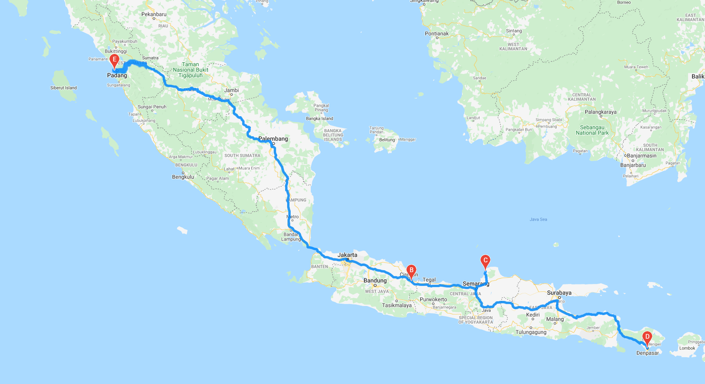

# Weather_World_Analysis  
  
### Project summary:  

The goal of the project is to create a random set of cities, allow user input to filter the set of cities based on maximum temperature, and create a travel itinerary from cities that pass the temperature filter.  
  
To create the set of random cities I first generated a random list of floating point numbers as latitude (between -90 and 90) and longitude (between -180 and 180).  Earch random location was matched to the nearest city (if possible) using citipy.nearest_city.  
  
I pulled weather information for each city using the Open Weather API.
  
I created a data frame of cities with their latitude and longitude as received from citipy and weather data from Open Weather API.
  
Using Google place API I extracted a hotel within 5,000 meters of the latitude and longitude of the cities.  
  
The user input upper and lower bounds of the temperature range they want for their vacation.  That input was used to filter the data frame to just the cities and hotels that are between the upper and lower bounds.  
  
  
  
I selected 4 cities to create a travel itinerary.    

